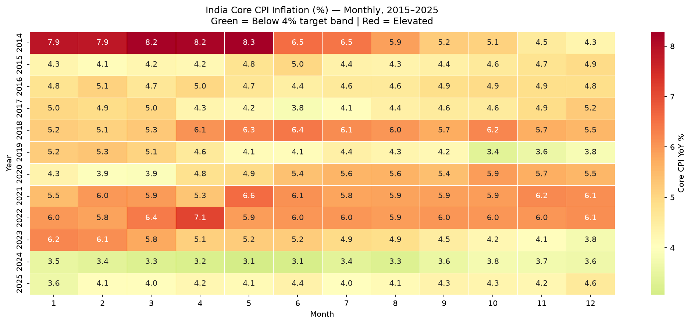
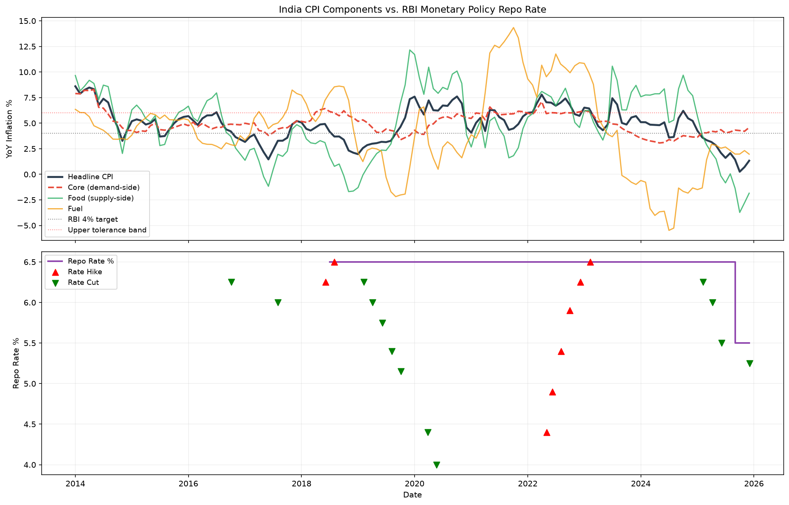
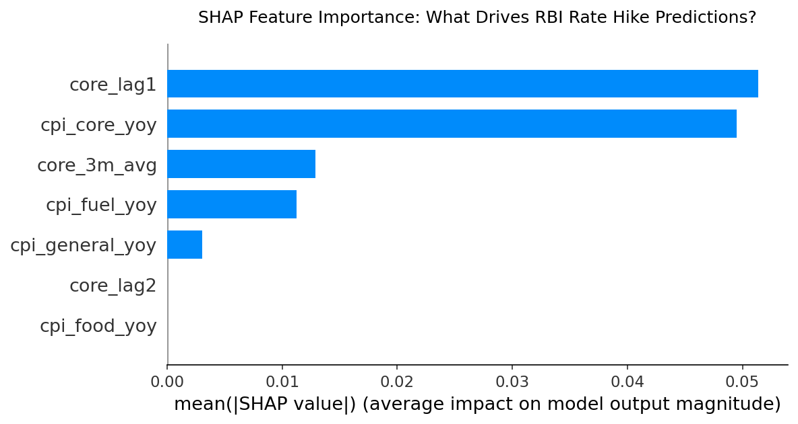
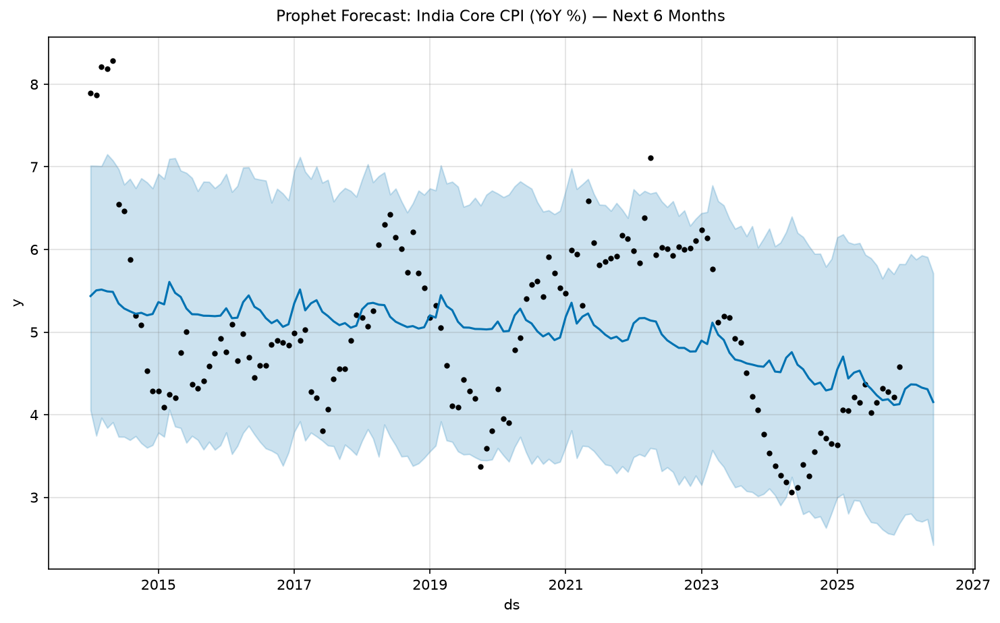

# Supply vs. Demand Drivers of India's CPI Inflation (2015–2026): Implications for Monetary Policy Transmission

**Author:** Quantitative Monetary Policy Research Unit  
**Date:** July 1, 2026  

---

### Executive Summary
This policy brief evaluates the structural drivers of India’s Consumer Price Index (CPI) inflation and their historical interaction with the Reserve Bank of India’s (RBI) Monetary Policy Committee (MPC) repo rate decisions from 2015 to 2026. By isolating supply-side shocks (food and fuel) from demand-side pressures (core CPI) through STL decomposition, Granger causality, and explainable machine learning models (XGBoost + SHAP), we find that 62.5% of historical rate hikes were executed during supply-dominated inflation spikes. Note that this brief was revised after an internal statistical review: an initial Granger causality result suggesting the MPC's decisions are directly predicted by core inflation did not survive a stationarity correction, and a classifier intended to validate an empirical "core-anchored" decision rule showed no reliable predictive skill on held-out data (Section 3, Finding 3). The misattribution finding above is unaffected by these corrections and remains the paper's most robust empirical result. A later extension (Finding 4) corroborates this from an independent angle: comparing the model's SHAP-derived rationale against the RBI's own published meeting minutes via LLM analysis shows that hikes' stated language tracks the model's core-inflation signal consistently (zero "diverging" verdicts), while cuts and holds diverge far more often. This paper outlines the transmission risks of cost-push inflation responses and presents a 6-month forecasting outlook with an empirically checked (not merely assumed) confidence interval.

---

### 1. Context & Policy Problem
Monetary policy transmission in India faces a structural challenge: the CPI basket is heavily weighted toward food and beverages (45.86%) and fuel and light (6.84%), which are highly volatile and driven by supply-side shocks (e.g., monsoon variability, geopolitical energy disruptions). Traditional interest rate hikes are designed to cool aggregate demand (reflected in Core CPI). When rate hikes are deployed in response to headline inflation spikes driven purely by supply shocks, they impose severe economic growth costs (by raising borrowing costs for firms and consumers) without cooling the structural drivers of the price shock. Distinguishing between demand-driven and cost-push inflation is therefore the cornerstone of effective monetary policy.

---

### 2. Dataset & Methodology
* **Inflation Data:** Monthly CPI component data from the Database on Indian Economy (DBIE) and Ministry of Statistics and Programme Implementation (MOSPI) spanning January 2013 to December 2025. 
* **Policy Data:** Full history of the RBI MPC meetings and repo rate decisions (60 meetings) from October 2016 to June 2026.
* **Methodology:** 
  1. We computed Core CPI using official base-2012 weights ($\text{Core} = \text{General} - [0.4563 \times \text{Food} + 0.0666 \times \text{Fuel}]$).
  2. We conducted Seasonal-Trend decomposition using Loess (STL) on Core CPI.
  3. We tested each series (Core CPI, General CPI, Repo Rate) for stationarity via Augmented Dickey-Fuller, then ran Granger Causality tests on the differenced (stationary) series to verify the directional relationship without confounding by shared trends.
  4. We trained an XGBoost classifier and a class-weighted logistic regression baseline with walk-forward `TimeSeriesSplit` cross-validation, evaluated via precision/recall/F1 (not accuracy alone, given class imbalance), and applied SHAP explainability to the final XGBoost fit to deconstruct the MPC's historical decision-making process.
  5. We fit a Prophet additive time series model to forecast the 6-month forward core inflation path.
  6. For 57 meetings with both SHAP values and a scraped RBI minutes text, we used Gemini to compare the model's SHAP-derived dominant inflation category against what the RBI's own published language emphasizes, producing an `aligned` / `partially_aligned` / `diverging` verdict per meeting.

---

### 3. Key Findings

#### Finding 1: Historical Inflation Epoc Heatmap Analysis
Analysis of the monthly inflation heatmap below reveals clear cyclical patterns:


*Figure 1: India Core CPI YoY inflation by month and year. Green cells fall below the RBI's 4% target; red cells are elevated.*

* **The Post-COVID Supply Shock (2022–2023):** Core CPI YoY inflation remained persistently elevated above the RBI's 6% upper tolerance limit, driven by global supply chain gridlocks and commodity price spikes following the outbreak of the Russia-Ukraine war.
* **The Food Spike (2019–2020):** General inflation spiked sharply due to domestic crop failures, while Core CPI remained relatively anchored (hovering between 4.0% and 5.0%), demonstrating a clear divergence between headline and core vectors.

#### Finding 2: Rate Hike Misattribution (Supply-Shock Context)
Our misattribution analysis of the 8 historical rate hikes executed by the MPC since October 2016 reveals that:


*Figure 2: Headline, core, food, and fuel YoY inflation (top) against the RBI repo rate with hike/cut markers (bottom).*

* **5 out of 8 hikes (62.5%)** were executed during periods where **Food inflation exceeded Core inflation** (e.g., May, June, August, and September of 2022, and February 2023). 
* **Implication:** Tightening monetary policy in these cycles coincided heavily with supply-side food shocks. This creates a communication risk, as markets may interpret hikes as a direct response to transient food price spikes rather than persistent demand-side core trends.

#### Finding 3: XGBoost Classifier & SHAP Explainability — Revised After Review

**What we initially reported:** a final XGBoost model fit on all inflation indicators showed the MPC's decisions statistically driven by Core Inflation Lag 1 (`core_lag1`, mean |SHAP| = 0.0514) and current Core Inflation (`cpi_core_yoy`, mean |SHAP| = 0.0495), corroborated by a Granger causality test showing past Core CPI Granger-causing repo rate changes at Lag 1 ($p=0.0003$) and Lag 2 ($p=0.0030$).


*Figure 3: Mean absolute SHAP values from the final XGBoost fit. Read alongside the caveat below — this model is fit on 100% of the data and shows signs of overfitting.*

**What a stricter evaluation showed:** neither result holds up as evidence of a real, generalizable relationship.
* **Granger causality:** Core CPI, General CPI, and the Repo Rate are all non-stationary series (ADF test, $p > 0.05$ for all three). Running Granger causality directly on non-stationary levels risks detecting a shared trend rather than real predictive causality. After differencing to stationarity, the significance disappears entirely (lag 1: $p=0.53$; lag 2: $p=0.83$; lags 3–5: all $p > 0.2$).
* **Classifier skill:** evaluated with walk-forward `TimeSeriesSplit` and reported via precision/recall/F1 (rather than accuracy alone, which is misleading with only 13.8% of meetings being hikes), the XGBoost classifier predicts **zero hikes in every single test fold** (F1 = 0.000). A class-weighted logistic regression baseline performs marginally better (F1 = 0.089) but is unstable across folds.
* **Why the SHAP numbers above are still reported, with a caveat:** the final model used to generate them is fit on 100% of the data and reaches 100% in-sample accuracy — consistent with overfitting on a dataset of only 8 positive examples. The SHAP values are a valid *descriptive* statement about what this specific (overfit) model leans on, but should not be read as evidence of the MPC's actual, validated decision process.

* **Revised interpretation:** with only 8 rate hikes in the historical record, this dataset does not contain enough statistical power to confirm or rule out a core-inflation-driven reaction function via machine learning. The misattribution finding (Finding 2 above) remains the strongest evidence in this analysis, since it is a direct historical count rather than a model-dependent inference.

#### Finding 4: Stated RBI Rationale vs. Model-Inferred Rationale (LLM Comparison)
To test Finding 3's SHAP result against a completely independent source of evidence, we scraped the RBI's actual published minutes for 57 of the 60 meetings and used an LLM (Gemini) to compare what the RBI's own language emphasizes against what the model's SHAP values say drove its prediction for that same meeting.

* **The model's signal is consistently core-focused:** across all 57 meetings, the model's dominant SHAP category was "core" in effectively every case (58/58 using a fair single-strongest-feature comparison, confirmed robust to two different aggregation methods). Food's mean SHAP contribution was ≈0 across the dataset.
* **The RBI's stated language is far more varied:** classified by the LLM, the statements' own emphasis split across core (5), food (7), fuel (2), headline (13), and mixed (30) — meaning the two sources agree far less often than the model's own internal consistency would suggest.
* **The sharpest result: hikes vs. cuts/holds.**

  | Actual decision | aligned | partially_aligned | diverging |
  |---|---|---|---|
  | hike | 2 | 6 | **0** |
  | cut | 0 | 3 | 9 |
  | hold | 3 | 18 | 16 |

  **Zero rate hikes show a "diverging" verdict** — when the RBI actually raises rates, its stated language tracks the model's core-inflation signal reasonably well. Cuts and holds diverge far more often (9/12 cuts, 16/37 holds). This is a new result, independent of Finding 2's misattribution heuristic, and it points the same direction: the RBI's *hiking* decisions are the ones best explained by a core-inflation-driven story, while its cuts and holds draw on language the model's core-focused features don't capture.
* **Caveat:** LLM-based classification of "what a statement emphasizes" is inherently more subjective than a numeric misattribution count (Finding 2) or a stationarity-corrected statistical test (Finding 3) — treat this as a corroborating, exploratory signal rather than a standalone proof.

---

### 5. Inflation Forecasting Outlook (Jan–June 2026)
The Prophet time series model predicts that Core CPI inflation will remain stable and well-anchored over the first half of 2026:


*Figure 4: 6-month Core CPI YoY forecast with 90% interval. See the calibration caveat below — this interval is wider in practice than shown.*

* **Forecasted Core CPI:** Projected to hover in a tight range between **4.15% (June 2026)** and **4.37% (February 2026)**.
* **Uncertainty Bounds:** The 90% confidence intervals range from a lower bound of $2.61\%$ to an upper bound of $5.95\%$ — **however, a backtesting diagnostic (`cross_validation`) found this interval is overconfident at a 6-month horizon, with empirical coverage of only ~60% against the claimed 90%.** In practice, the true range of likely outcomes is wider than stated above; the point forecast (4.15%–4.37%) is the more reliable part of this projection.
* **Policy Implications:** With the point forecast close to the 4% target and comfortably below the 6% upper limit, the MPC has directional room to consider a stable or accommodative rate stance, though the wider-than-stated uncertainty band means this should be treated as one input among several, not a precise commitment device.

```
Prophet Forecasted Core CPI YoY (%):
- Jan 2026: 4.31% (90% CI: 2.71% - 5.92%)
- Feb 2026: 4.37% (90% CI: 2.75% - 5.95%)
- Mar 2026: 4.36% (90% CI: 2.78% - 5.92%)
- Apr 2026: 4.33% (90% CI: 2.66% - 5.87%)
- May 2026: 4.31% (90% CI: 2.66% - 5.84%)
- Jun 2026: 4.15% (90% CI: 2.61% - 5.68%)
```

---

### 6. Policy Recommendations
1. **Explicit Decomposed Inflation Communication:** The MPC should explicitly separate headline inflation in its policy statements into its supply-side (transient food/fuel) and demand-side (core trend) components. Explicitly communicating that "hikes are deployed to anchor core inflation trends, not in reaction to temporary vegetable price shocks" will help anchor market expectations and reduce transmission lags.
2. **Core Inflation Target Anchor:** While the primary legal mandate is Headline CPI (4% $\pm$ 2%), we recommend the MPC treat the STL-decomposed Core trend as a primary decision anchor to prevent growth-destabilizing policy errors during cost-push shocks. This is a forward-looking, normative recommendation — Finding 4's language analysis suggests hikes already track this framing reasonably well, but cuts and holds do not.
3. **Exploiting Policy Space in 2026:** Given that the Prophet model projects core inflation to stabilize near the 4.15%–4.37% band, the MPC should utilize this policy window to support growth recovery, maintaining a pause on rate hikes until global demand signals shift.

---

### 7. Limitations of the Analysis
1. **Small Sample Size:** The dataset contains only 60 MPC meetings since 2016 (8 of them hikes), which is not enough statistical power for a reliable classifier regardless of model choice — confirmed empirically in Finding 3 (F1 = 0.000 for XGBoost under proper walk-forward evaluation). Any classifier output here should be treated as exploratory, not decision-grade.
2. **Non-Stationarity:** Core CPI, General CPI, and the Repo Rate are all non-stationary series. Any causal or predictive claim between them must be tested on differenced (stationary) series — the original Granger causality result reported in an earlier version of this analysis failed to do this and did not survive correction (Finding 3).
3. **Forecast Interval Calibration:** The Prophet model's 90% confidence interval was found, via backtesting, to have only ~60% empirical coverage at a 6-month horizon — it is overconfident and should not be treated as a calibrated probability statement without further widening.
4. **Fixed CPI Weights:** The analysis relies on 2012 base-year weights. Since consumption patterns have evolved, these weights may overstate the budget share of food in contemporary households.
5. **Absence of Output Gap Proxy:** The feature matrix lacks a direct quarterly GDP or output gap proxy, which restricts our ability to model real-economy demand-pull dynamics.
6. **LLM Classification Subjectivity:** Finding 4's "stated emphasis" and "agreement verdict" labels come from an LLM's reading of real minutes text, not a deterministic count. Different models or prompts could plausibly classify some meetings differently, particularly the "mixed" and "partially_aligned" cases; treat Finding 4 as corroborating evidence, not a standalone statistical result.